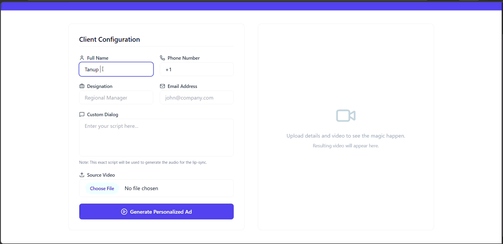
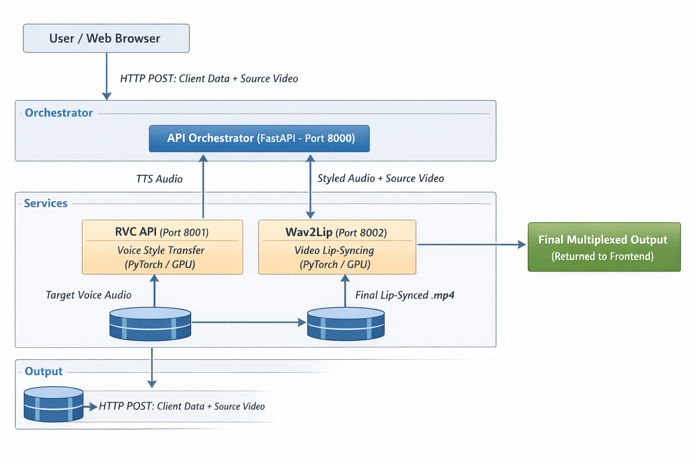
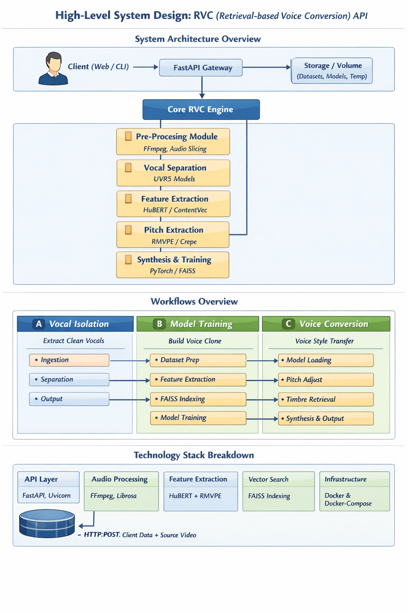
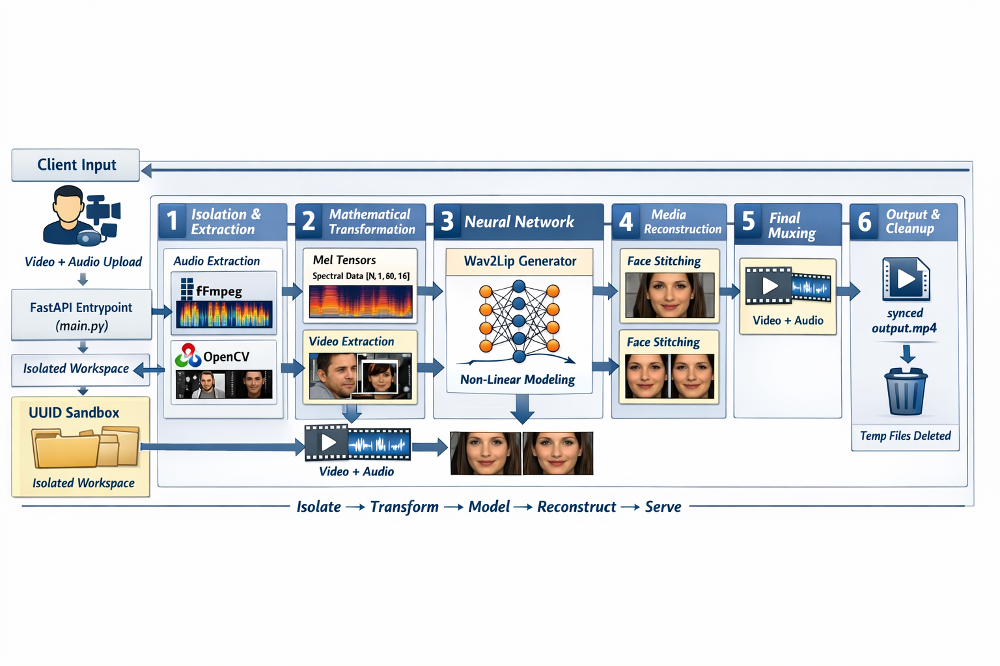

# GenAI Ad Platform

The GenAI Hyper-Personalized Ad Platform is an automated, machine learning-driven pipeline designed to generate custom video advertisements at scale. By taking a driving text script, client data, and a base actor video, the system synthesizes realistic, lip-synced video outputs featuring a specific target voice.

The system leverages a decoupled microservices architecture to orchestrate Text-to-Speech (gTTS), Voice Style Transfer (RVC), and Video Lip-Syncing (Wav2Lip), ensuring that heavy GPU-bound PyTorch workloads do not block the web application's event loop.

## Demo Video

### ▶ Video : End‑to‑End Gen AI based Add creation

[](https://drive.google.com/file/d/1XieoHJMR0nLRUnfjvocxprYNpB8co1RZ/view?usp=sharing)


##  High-Level System Architecture

The platform is divided into three primary tiers: the Client Interface, the API Orchestrator, and the ML Microservices layer.

###  HLSD : End‑to‑End Flow of Add Platform

[]()  

---

##  Microservice API Specifications

The compute-intensive workloads are distributed across two distinct REST APIs. This allows for horizontal scaling and prevents Python dependency conflicts between the discrete ML codebases.

### 1. Voice Conversion Service (RVC)

###  HLSD : End‑to‑End Flow of RVC

[]()

A headless FastAPI backend managing Retrieval-based Voice Conversion.

* **`POST /infer`**: Core inference endpoint. Accepts source audio and applies the target voice model (`brand_ambassador.pth`). Supports pitch shifting (`f0_up_key`) and feature retrieval mixing (`index_rate`).
* **`POST /isolate`**: Utility endpoint leveraging `UVR5` to separate vocals from background noise/music.
* **`POST /train`**: Background task endpoint triggering a Distributed Data Parallel (DDP) training loop, which encompasses dataset preprocessing, Faiss index generation, and VITS model training.

### 2. Lip-Sync Service (Wav2Lip) 

###  HLSD : End‑to‑End Flow of LIPSYNC

[]()

A FastAPI backend preloaded with face detection and GAN-based video models in GPU memory to eliminate cold-start latency.

* **`POST /infer`**: Accepts a source `.mp4` and a driving `.wav` file. Computes facial landmarks and synchronizes lip movements. Uses isolated UUID-based temp directories for thread-safe concurrent processing.
* **`POST /train`**: Triggers a background worker for High-Quality (HQ) Wav2Lip training loops utilizing `syncnet` discriminator checkpoints.

##  Environment Prerequisites

Before initiating the deployment, ensure the host environment meets the following specifications:

* **Hardware:** NVIDIA GPU with updated drivers (Mandatory for PyTorch CUDA execution).
* **Containerization:** Docker & Docker Compose configured with the `nvidia-container-toolkit` to allow GPU passthrough to the containers.
* **Runtime:** Python 3.10+ (for the Orchestrator) and Node.js 18+ (for the Frontend).

##  Deployment 

### Step 1: Initialize ML Microservices (Docker)

To maintain absolute dependency isolation, the core models run in independent Docker containers.

**1A. Deploying the RVC (Voice) Service**

1. Navigate to the `rvc_service` directory.
2. Ensure your trained model (`brand_ambassador.pth`) is located in `./models/`.
3. Verify `docker-compose.yaml` maps the container to host port **8001**:

   ```yaml
   services:
     rvc-api:
       ports:
         - "8001:8000" 
   ```

4. Build and deploy in detached mode:

   ```bash
   docker-compose up -d --build
   ```

**1B. Deploying the Wav2Lip (Video) Service**

1. Navigate to the `wav2lip_service` directory.
2. Ensure the `wav2lip_gan.pth` checkpoint is located in `./checkpoints/`.
3. Verify `docker-compose.yaml` maps the container to host port **8002**:

   ```yaml
   services:
     wav2lip-api:
       ports:
         - "8002:8000" 
   ```

4. Build and deploy in detached mode:

   ```bash
   docker-compose up -d --build
   ```


### Step 2: Gen AI Hyper Personalized Add Portal

The portal serves as the traffic controller, mediating between the React frontend and the backend ML containers via asynchronous HTTP (`httpx`).

1. Navigate to the `Gen-AI-Hyper-Personalized-Add-Portal/` directory.
2. Initialize and activate a Python virtual environment:

   ```bash
   python -m venv venv
   source venv/bin/activate  
   ```

3. Install dependencies:

   ```bash
   pip install fastapi uvicorn httpx gTTS python-multipart
   ```

4. Launch the server (Default configuration targets `localhost:8001` and `localhost:8002`):

   ```bash
   uvicorn orchestrator:app --host 0.0.0.0 --port 8000
   ```

### Step 3: Launch the React Frontend

1. Navigate to the `ad-portal-frontend/` directory.
2. Install Node dependencies (includes Vite, React, Tailwind CSS, and Lucide icons):

   ```bash
   npm install
   ```

3. Start the Vite development server:

   ```bash
   npm run dev
   ```

## End-to-End Execution Sequence

1. Access the web interface at **`http://localhost:5173`**.
2. Input the client payload (Name, Designation, Email).
3. Input the Custom Dialog script.
4. Upload a source video file (e.g., `actor_source.mp4`).
5. Click **Generate Personalized Ad**.

**Pipeline Trace:**

1. The React client posts `multipart/form-data` to `Orchestrator:8000`.
2. The Orchestrator leverages `gTTS` to generate a base `.wav` file.
3. The Orchestrator forwards the `.wav` to `RVC:8001` to apply the target voice topology.
4. The Orchestrator receives the stylized audio and forwards both the new `.wav` and the original `.mp4` to `Wav2Lip:8002`.
5. `Wav2Lip` utilizes the GPU to map facial landmarks, mask the jawline, and generate the lip-synced frames.
6. The Orchestrator receives the final `.mp4` and streams it back to the React client via a `FileResponse`.

## Troubleshooting Matrix

* **CORS Exceptions:** If the frontend fetch fails, verify the Orchestrator's `CORSMiddleware` includes your frontend's exact origin (e.g., `http://localhost:5173`).
* **504 Gateway Timeout:** Video synthesis is highly compute-intensive. Ensure `httpx.AsyncClient(timeout=600.0)` in the Orchestrator is appropriately configured for your specific hardware's processing speed.
* **CUDA Out of Memory (OOM):** If the Wav2Lip Docker container crashes during inference, reduce the input video resolution. 720p or 1080p is strongly recommended to balance output quality and VRAM utilization.
* **Missing Checkpoints (500 Error on Init):** Confirm `brand_ambassador.pth`, `wav2lip_gan.pth`, and required base models (`hubert_base.pt`) are securely mounted in the Docker volumes defined in `docker-compose.yaml`.

## Teardown & Resource Release

To gracefully terminate the platform and flush GPU VRAM:

1. Terminate the Vite and Uvicorn foreground processes via `Ctrl + C`.
2. Spin down the ML containers from their respective directories:

   ```bash
   docker-compose down
   ```

   *(Note: The `down` command safely stops and removes the containers but preserves any trained models or data stored in the mapped volumes).*

## Author

**Tanup Vats**
   
